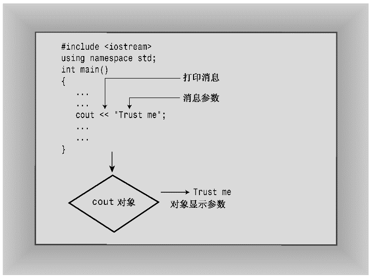
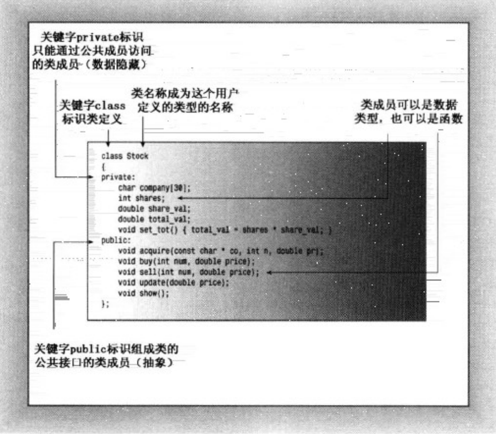

# C++中的类

## 类简介

- 类是用户自定义的数据类型，它是数据和操作数据的函数的集合。
- 类之于对象就像类型之于变量。**即类是对象的抽象，对象是类的实例。** 类好比所有著名的演员，而对象好比某个著名的演员，而表示演员的类中包括该类可执行的操作的定义，如念台词、表达情绪等。  

创建一个 `int` 类型的变量 `carrots`，也就是说 `carrots` 可以存储整数，可以按照特定的方式使用，比如加和减。`cout` 是一个 `ostream` 类的对象，`ostream` 的类定义（`iostream` 文件的另一个成员）描述了 `ostream` 对象表示的数据以及可以对它执行的操作，如将数字或字符串插入到输出流中。  
***注意：类描述了一种数据类型的全部属性（包括可使用它执行的操作），对象是根据这些描述创建的实体。***

!!! abstract

    类 — 汽车的设计图纸  
    实例化（对象）— 生产出的汽车  
    停车场 — 计算机的存储  
    停车场编号 — 内存的地址  
    类是用来描述实例的，实例是类的具体结果  
    面向对象的三大特征：  
    封装 — 类的集合  
    继承 — 通用的标准 车轮 方向盘等  
    多态 — 各式各样的小汽车 🚙🚗🚕🚌🚎🚓



## C++ 中的类

类是一种将抽象转换成用户定义的 C++ 工具，它将 **数据表示和操纵数据** 的方法组合在一起。类的定义包括 **数据成员** 和 **成员函数**。数据成员表示类的数据，成员函数表示类的操作。

!!! note

    类的定义只是一个模板，它本身并不占用内存。只有在创建类的对象时，内存才会被分配。  
    一般来说：类的规范由两个部分组成：类声明和类定义。
    - 类声明：以数据成员的方式描述数据部分，以成员函数的方式描述公有接口。
    - 类方法定义：描述如何实现类声明中描述的接口。

### 访问控制

- `public`：类的成员在类的外部可以被访问。
- `private`：类的成员在类的外部不可以被访问，只有类的成员函数可以访问。
这体现了 **封装** 的思想，即将数据和操作数据的方法组合在一起，数据被隐藏在类的内部，只有类的成员函数可以访问。

> ***注意***：类和结构的唯一区别是默认的访问控制。类的默认访问控制是 `private`，而结构的默认访问控制是 `public`。



### 什么时候调用析构函数

- 静态存储类型：在程序结束时调用。
- 自动存储类型：程序执行完代码块（所处块作用域）时调用。
- 对象是通过 `new` 创建的：在对象被 `delete` 时调用。
- 临时对象：在表达式结束时调用。

### 类作用域

在类中定义的名称（如类数据成员名和类成员函数名）的作用域都为整个类，作用域为整个类的名称只在该类中是已知的，在类外是不可知的。因此，可以在不同类中使用相同的类成员名而不会引起冲突。*例如，`Stock` 类的 `shares` 成员不同于 `JobRide` 类的 `shares` 成员*。另外，类作用域意味着不能从外部直接访问类的成员，公有成员函数也是如此。也就是说，要调用公有成员函数，必须通过对象

### 作用域为类的常量

类声明中定义一个所有对象共享的常量时，下面的方式是错误的：（因为声明只提供了类的形式，并没有进行实例化）

!!! bug

    ```c++
    class Stock
    {
        const int Months = 12;
        int sales[Months];      // 错误
    }
    ```

!!! success

    以下是正确的方式：
    ```c++
    class Stock
    {
        static const int Months = 12; // 该常量将与其他静态变量存储在一起，而不是存储在对象中。因此，只有一个 Months 常量，被所有 Bakery 对象共享。
        int sales[Months];
    }
    ```

    或者使用枚举

    ```c++
    class Stock
    {
        enum {Months = 12}; // 枚举，它的值在编译时就确定了，因此可以用来定义数组的大小
        int sales[Months];
    }
    ```

它们的共同特点都是在 **编译时** 就确定了，因此可用作常量。
