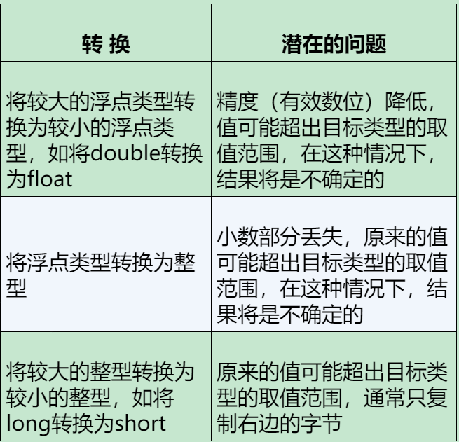

# 变量与存储

## C++11 中的 `auto` 声明

- `auto` 声明让编译器通过初始值来推算变量的类型，但是 `auto` 定义的变量必须有初始值。
- `auto` 声明的变量必须马上初始化，因为编译器必须知道变量的类型。

```c++
auto n = 100;       // n 是 int 类型
auto x = 1.5;       // x 是 double 类型
auto y = 1.3e12L;   // y 是 long double 类型
auto z = 1.3e12;    // z 是 double 类型
auto w = 1.3e12f;
```

### C++ 如何确定 `auto` 常量的类型

对于整数，除非有理由存储为其他类型，否则 C++ 将其存储为 `int` 类型。对于浮点数，除非有理由存储为其他类型，否则 C++ 将其存储为 `double` 类型。

```c++
auto i = 10;    // 这里的 i 会被 C++ 存储为 int 类型
auto d = 10.0;  // 这里的 d 会被 C++ 存储为 double 类型
```

后缀：放在数字后面表示类型的字母；
  
| 后缀  |      类型      |         说明         |
| :---: | :------------: | :------------------: |
| `ULL` | 无符号长长整型 | 无符号的长长整数类型 |
| `UL`  |  无符号长整型  |  无符号的长整数类型  |
|  `U`  |   无符号整型   |   无符号的整数类型   |
| `LL`  |    长长整型    | 有符号的长长整数类型 |
|  `L`  |     长整型     |  有符号的长整数类型  |
|  `F`  |  单精度浮点型  |   单精度浮点数类型   |
|  `L`  | 长双精度浮点型 |  长双精度浮点数类型  |

- 对于不带后缀的十进制整数，将使用下面几种类型中能够 **存储该数的最小类型** ：`int`、`long`、`long long`。
- 对于不带后缀的八进制或十六进制整数，将使用下面几种类型中能够 **存储该数的最小类型** ：`int`、`unsigned int`、`long`、`unsigned long`、`long long`、`unsigned long long`。 (1)
    { .annotate }

    1. 十六进制数经常被表示为地址，而地址没有符号，因此 `unsigned` 比 `long` 更适合用来表示 16 位的地址

## 通用字符名与宽字符类型

### 通用字符名

- 通用字符名（Universal Character Names, UCN）是 C++ 和 C 语言中的一个特性，允许你使用 Unicode 字符集中的任何字符。这些字符可以直接在字符串和字符字面量中使用，也可以通过其对应的 UCN（形式为 `\uNNNN` 或 `\UNNNNNNNN` ）使用，其中 N 是十六进制数字。

- 其用法与转义序列类似，通用字符名以 `\u` 或 `\U` 开头， *`\u` 后面是 8 个十六进制位，`\U` 后面则是 16 个十六进制位* 。这些位表示的是字符的 ISO 10646 码点.

!!! example

    ```C++
    #include <iostream>
    int main()
    {
        std::cout << "\u00e5" << std::endl; // 输出 å
    }
    ```

!!! info

    ***Unicode*** ： Unicode 是一个字符集，为世界上的每种语言的每个字符分配了一个唯一的数字，称为码点。Unicode 可以容纳超过一百万个字符，覆盖了世界上几乎所有的书写系统。  
    ***UTF-8*** ： UTF-8 是一种将 Unicode 码点编码为字节序列的方法。它是一种变长编码，每个字符可以由 1 到 4 个字节表示。 UTF-8 与 ASCII 兼容，即 ASCII 字符在 UTF-8 编码中仍然是单字节，并且字节值与 ASCII 编码相同。  
    ***ASCII*** ： ASCII 是一种字符编码标准，只能表示基本的拉丁字母、数字和符号。ASCII 是 7 位编码，只能表示 128 个不同的字符。ASCII 是 Unicode 和 UTF-8 的一个子集，也就是说，ASCII 字符在 Unicode 和 UTF-8 中的表示方式与 ASCII 中的表示方式相同。  
    ***ISO 10646*** ：ISO 10646 是一个由国际标准化组织（ISO）定义的字符集，其目标与 Unicode 相同，即为世界上的每种语言的每个字符分配一个唯一的数字。实际上，Unicode 和 ISO 10646 现在已经被同步，即它们分配给字符的码点是相同的。  
    总的来说，Unicode 和 ISO 10646 定义了字符和数字之间的映射，而 UTF-8 和 ASCII 则定义了如何将这些数字编码为字节序列。  

### 宽字符类型

- `char` 在默认情况下 **既不是有符号也不是无符号的** ，是否有符号由编译器决定以便与硬件属性匹配。*例如，对于某些硬件，使用无符号字符可能更有效率。而对于其他硬件，使用有符号字符可能更合适*。 (1)
    { .annotate }

    1. 除非显式设置为 `signed` 或 `unsigned`

- `wchar_t` 是一种 **宽字符类型**（占用两个字节），它可以用来存储大多数机器的扩展字符集中的字符。*它的确切大小是与实现相关的，但是它至少与 `char` 一样大*。

```C++
#include <iostream>
int main()
{
    wchar_t bob = L'P';                 // L 前缀指示宽字符常量和宽字符串
    std::wcout << bob << std::endl;     // 输出 P
}
```

`cin` 和 `cout` 将输入输出看作是字符流，而不是字节流。因此，它们使用 `wchar_t` 类型的 `wcin` 和 `wcout` 对象来处理宽字符。*`wcin` 和 `wcout` 对象的行为与 `cin` 和 `cout`对象的行为相同，只是它们使用 `wchar_t` 类型的数据*。

- char16_t：用于存储 UTF-16 编码的字符，占用两个字节。
- char32_t：用于存储 UTF-32 编码的字符，占用四个字节。

```C++
#include <iostream>
int main()
{
    char16_t bob = u'P';            // u 前缀指示 UTF-16 字符常量和字符串
    std::cout << bob << std::endl;  // 输出 P
    char32_t bob2 = U'P';           // U 前缀指示 UTF-32 字符常量和字符串
    std::cout << bob2 << std::endl; // 输出 P
}
```

## 定点表示法和浮点表示法

在 C++ 中，定点表示法和浮点表示法是两种不同的方式来显示浮点数。

- **定点表示法（Fixed Point Notation）**：在定点表示法中，小数点的位置是固定的。例如，数字 123.456 在定点表示法中就是「123.456」。这种表示法适合于小数点后的位数较少的情况。

- **浮点表示法（Floating Point Notation）**：在浮点表示法中，小数点的位置是可以移动的，通常用于表示非常大或非常小的数。例如，数字「123456000.0」在浮点表示法中可以表示为「1.23456e+08」，这里的「e+08」表示 10 的 8 次方。

`cout.setf(ios_base::fixed, ios_base::floatfield);` 这行代码设置了 `cout` 对象的格式标志，使得浮点数以定点表示法输出，而不是默认的浮点表示法，小数点后的位数将根据设置的精度来决定。

## 类型转换

将两个 `long` 值相加涉及到的硬件编译指令可能会与两个 `short` 值相加不同。有 11 种整型和 3 种浮点类型，因此，C++ 提供了一种机制，用于将一种类型的值转换为另一种类型的值。这种机制称为 ***类型转换（type conversion）或强制类型转换（type casting）***。

- 将一种算术类型的值赋给另一种算术类型的变量时，C++ 将对值进行转换。*例如，将 `int` 值赋给 `double` 变量时，C++ 将` int` 值转换为 `double` 值*。
- 当表达式中包含不同的类型时，C++ 将对值进行转换。*例如，将 `int` 值和 `double` 值相加时，C++ 将 `int` 值转换为 `double` 值*。
- 将参数传递给函数时，C++ 将对值进行转换。*例如，将 `int` 值传递给接受 `double` 参数的函数时，C++ 将 `int` 值转换为 `double` 值*。


---

### 以 {} 方式初始化时进行的转换（C++）

  列表初始化对类型转换的要求更严格，不允许缩窄（narrowing）。例如：不允许将浮点转换为整型，不允许将长整型转换为整型。*但是允许将整型转换为浮点，允许将整型转换为长整型*，***条件是编译器知道目标变量能够正确地存储源值***。

!!! example

    ```C++
    #include <iostream>
    int main()
    {
        const int code = 5;
        int cat = 5;
        int dog = 3.14;     // 允许
        int bird{3.14};     // 不允许
        int wolf = {3.14};  // 不允许
        int cow = {code};   // 允许
        char parrot{x};     // 不允许窄化转化，int 范围比 char 大（ C 语言允许窄转化）
        char horse{24};     // 允许
        return 0;
    }
    ```

### 表达式中的转换

C 的整型算术运算总是至少以缺省整型类型的精度来进行的。  
为了获得这个精度，**表达式中的字符和短整型操作数在使用之前被转换为普通整型**，这种转换称为 ***整型提升*** 。

- 如果 `char`，`short` 或者 `bool` 类型的表达式被用在需要 `int` 类型的地方，那么这些类型的值会被提升为 `int` 类型。

- 如果 `unsigned char` 或者 `unsigned short` 的值可以被 `int` 类型表示，那么这些类型的值也会被提升为 `int` 类型。否则，它们会被提升为 `unsigned int` 类型。

  

??? quote

    [整型提升](https://blog.csdn.net/qq_39208237/article/details/109503755?ops_request_misc=%257B%2522request%255Fid%2522%253A%2522170213342116800211550161%2522%252C%2522scm%2522%253A%252220140713.130102334..%2522%257D&request_id=170213342116800211550161&biz_id=0&spm=1018.2226.3001.4187)

    > 空间大又不是不能存储字节数少的数据。是的，话没错，能存，但问题在于我是 4 个字节的空间（大房间里有四个小房子），你是少于 4 个字节的数据（不能完全占据整个大房间），我到底该把你安排在哪个小房间里？我把你随便放进去的话，我要用你时又要在 4 个小房间里查找你到底在哪些房间里，这样势必会让我的效率变低。所以，你在住进来时，不好意思，你至少得把自己变成 4 个字节的，我再把你直接放进去，用你时我也不用查你在哪，我找到大房间就找到了你。  
    可能这会有人会问，那我多于 4 个字节怎么办？不要担心，你多于 4 个字节，大不了我给你再安排一间大房子，你一个人住两间总该够了。***在 64 位平台，C 语言非自定义数据类型的字节数只有 4 种（1,2,4,8）***。两间大房子妥妥把你舒舒服服住好喽！

!!! example

    ```C++
    #include <iostream>
    int main() {
        char a = 'A';
        int b = a + 1;                  // 这里的「A」被提升为 int 类型，然后进行加法运算
        std::cout << b << std::endl;    // 输出 66
        return 0;
    }
    ```

总而言之，类型转换都是为了 ***尽可能不丢失精度***  (1)
{ .annotate }

1. 长度短的被隐式转换为长度长的，较小的类型被转换为较大的类型

### 强制类型转换

- 通用格式如下：

=== "C"

    ```c
    (typeName) value;//来自 C 语言
    ```

=== "C++"

    ```c++
    typeName (value);//纯粹的 C++ 语法
    ```
（特定于 C++ 的强制类型转换符将在后续介绍）

## 存储类型

- `auto`：自动存储类别，用于定义局部变量，是所有局部变量的默认存储类别。  
  自动变量通常存储在 ***栈*** 中。执行代码块时，其中的变量将被依次加入到栈中，当退出代码块时，这些变量将从栈中弹出。这被称为 **先入后出（FILO）** 的顺序。
- `static`：两种方式定义静态变量： 

    - 在函数外面定义它，若加上 `static`，则使其从具有外部链接到具有内部链接；
    - 函数内部声明变量时加上 `static`。

- `register`：用于定义存储在寄存器中而不是 RAM 中的局部变量。这意味着变量的最大尺寸等于寄存器的大小 (1)，且不能对它应用一元的`&`运算符 (2)。  
    { .annotate }

    1. 通常是一个字长
    2. 因为它没有内存位置，所以不能使用 `&` 运算符

- 动态存储：用于定义在程序执行期间可以扩展或缩减的局部变量。
    
  ```cpp
  int *p = new int;  
  delete p;
  ```

- 被分配的内存位于 ***堆*** 中，这是一种用于编程时进行内存分配的通用内存池。与栈不同，程序员负责在程序中的适当位置释放堆内存。如果程序员不这样做，这块内存将在程序结束时自动释放。

## 说明符和限定符

### 存储说明符

- `auto` 自动存储说明符，用于定义局部变量，是所有局部变量的默认存储说明符。C++11 后，`auto` 用于类型推断。
- `register` 用于定义存储在寄存器中而不是 RAM 中的局部变量。这意味着变量的最大尺寸等于寄存器的大小，且不能对它应用一元的 `&` 运算符。C++11 中，`register` 只是显式地指出变量是自动的。
- `static` 用于全局变量表示其具有内部链接，用于局部变量表示其存储持续性为静态的。
- `extern` 是引用声明，用于提供一个全局变量的引用声明，而不是定义它。*作用于函数时可以省略*。  

```c++
extern int a;       // 声明
void foo();
extern void foo();  // 与上面的等价
```

- `thread_local`：C++11 新增，指出变量持续性与其所属的线程相同。相当于 `static` 的线程版本。
- `mutable`：用于类的成员变量，表示该变量可以在 `const` 成员函数中被修改。

```c++
struct function
{
    mutable int a;
    int b;
}
int main()
{
    const function test;
    test.a = 1;         // 合法，test.a 是可变的
    test.b = 1;         // 不合法
}
```

### CV 限定符

- `const`：用于声明只读变量，或者用于声明只读成员函数。*作用于指针时，表示指针指向的对象是只读的*。**在 C++ 中，全局 `const` 定义就像使用了 `static` 说明符一样 。考虑：头文件中定义的 `const` 变量被多个源文件包含，若其具有外部链接，根据单定义规则将会导致重复定义。使用 `extern` 关键字可以覆盖默认的内部链接属性**。

```c++
const int a = 1;        // 内部链接
extern const int b = 1; // 外部链接
```

- `volatile`：表明即使 **程序未对变量进行修改，变量的值也可能发生变化** (1)。该关键字是为了防止编译器对变量进行优化。*例如，假设编译器程序在几条语句中两次使用某个变量的值，可能不会查找这个值两次，而是使用寄存器中缓存的值，前提是假设该值不会发生变化*，关键字告诉编译器不要使用这种优化。  
    { .annotate }

    1. 硬件或者操作系统可能会更改变量的值，而编译器不知道这一点 

下面是 `volatile` 变量的几个例子：

 1. 并行设备的硬件寄存器（如：状态寄存器）
 2. 一个中断服务子程序中会访问到的非自动变量 (Non-automatic variables)
 3. 多线程应用中被几个任务共享的变量

## 语言链接性

- `extern "C"`：用于指定 C 语言链接性，告诉编译器按照 C 语言的规则进行链接。*C++ 编译器会对函数名进行修饰，而 C 语言不会*。  
  例如，C++ 编译器会将 `void func(int a)` 编译为 `_func@4` ，而 C 语言编译器会将 `void func(int a)` 编译为 `_func`。  
  通常用于 C++ 调用 C 语言函数。

```c++
extern "C" void func(int a);    // 不能再使用 C++ 的重载特性，应按照 C 的规则进行链接
extern void func(int a);        // 仍然可以使用 C++ 的重载特性
extern "C++" void func(int a);  // 显式地指出函数是 C++ 的
```

**这在你需要在 C++ 代码中调用 C 语言编写的函数时非常有用。**

## 静态变量的初始化

- 静态变量在程序开始时就已经初始化，而不是在程序运行时初始化。它在整个程序运行期间都存在。
- 首先，静态变量都被 **零初始化**，不管程序员是否显式地初始化了它。接下来如果使用常量表达式初始化了变量，且编译器仅根据文件内容（包括被包含的头文件）就可以计算表达式，编译器将根据常量表达式初始化变量。必要时可以进行简单的计算。否则，变量将被 **动态初始化**。
  
```c++
#include <cmath>
    ...
    int x;
    int y = 5;
    long z = 10*15;
    double w = asin(1.0);   // 要初始化 w，需要调用 asin() 函数，这要等到函数被链接到程序中时才能完成
```