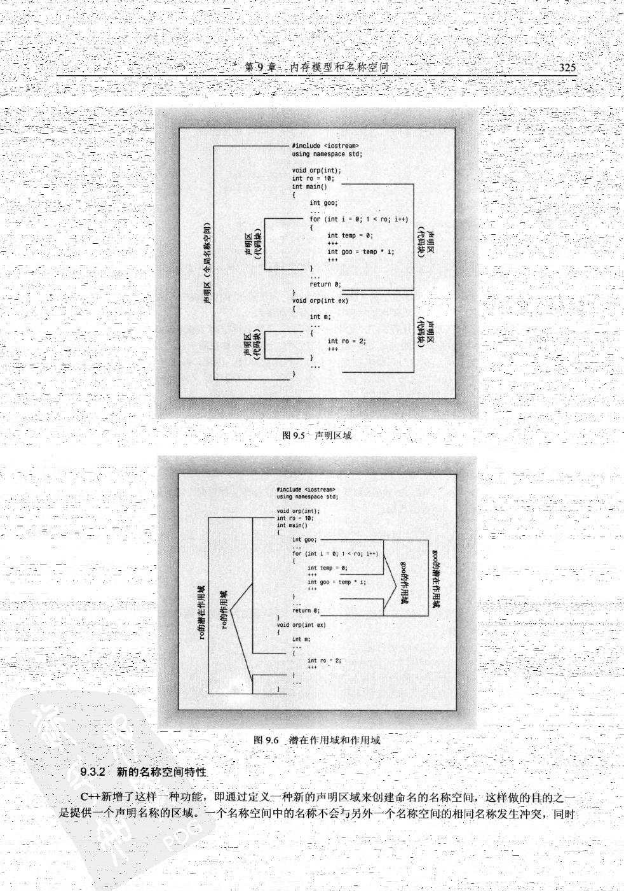
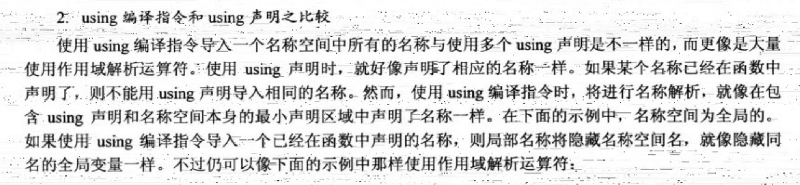

# 名称空间

## 传统的 C++ 名称空间

- **声明区域**：可以在其中声明的区域。*例如：在函数外部声明全局变量，其声明区域为其声明所在的文件。在函数中声明的变量，其声明区域为其声明所在的代码块。*
- **潜在作用域**：变量的作用域从声明点开始，到其声明区域的末尾。潜在作用域比声明区域小，是由于变量必须被定义后才能使用。

??? warning

    变量并非在潜在作用域的任何位置都是可见的，会出现被另一个嵌套声明区域中的同名变量所遮蔽的情况。变量对程序可见的范围被称为作用域
    

## 新的名称空间特性

定义一种带有名称的声明区域，用于避免名称冲突。名称空间的声明形式如下：

```c++
namespace name
{
    // code
}
```

名称空间的声明区域是全局的（除非它引用了常量），因此名称空间可以跨越多个文件。名称空间的声明区域可以包含变量、函数、类等。名称空间的声明区域可以嵌套。

!!! note

    ***注意***：C++ 中常量的链接性可以是外部的，但对于常量引用，情况有些不同。C++ 的常量默认都是内部链接的，它们只在定义它们的文件中可见。但是，如果你想在多个文件中共享常量，你可以使用 `extern` 关键字。
    
    ```c++
    extern const int a = 1;  // 外部链接
    ```
    
    由于引用不占用空间，它只是别名，所以它 **没有链接性**。如果你试图在一个文件中定义一个常量引用，并在另一个文件中声明它，你会遇到问题，因为引用必须在定义时初始化，这个初始化只能在定义的文件中完成。

## 全局名称空间

C++ 程序中的所有名称都在全局名称空间中。全局名称空间没有名称，因此不能使用 `using` 声明来引用它。全局名称空间中的名称可以通过作用域解析运算符 `::` 来访问。

```c++
#include <iostream>

    // 在全局名称空间中定义一个变量
int globalVar = 10;

int main() {
    // 访问全局名称空间中的变量
    std::cout << "Global variable: " << globalVar << std::endl;
    return 0;
}
```

> ***注意***：简单来说，名称空间本质上就是对声明区域的划分。



## 多函数程序中使用 `using` 编译指令

- 将 `using namespace std;` 放在函数定义之前，让文件中所有的函数都能使用名称空间 `std` 中所有的元素。
- 将 `using namespace std;` 放在特定的函数定义中，让该函数能够使用名称空间 `std` 中所有的元素。
- 在特定的函数中使用类似 `using std::cout;` 的编译指令，而不是 `using namespace std;`，让该函数能够使用指定的元素。
- 完全不使用编译指令 `using`，而在需要使用名称空间 `std` 中的元素时，使用前缀 `std::`。

### 关于冲突问题

- `using std::cout;`：这是一个 ***使用声明***，它告诉编译器在后续的代码中，如果遇到 `cout`，就应该理解为 `std::cout`。这样，你就可以在后续的代码中直接使用 `cout`，而不需要每次都写出 `std::cout`。*这种方式可以减少代码的冗余，但是如果在同一个作用域中有其他的 `cout`（例如，你自己定义的变量或函数），就可能导致命名冲突*。

- `std::cout`：这是对cout的 ***完全限定名*** 的使用。`std::cout` 是在 `std` 命名空间中定义的一个对象，用于向标准输出（通常是控制台）写入数据。每次使用 `std::cout` 都需要写出 `std::` 前缀，*这样可以避免命名冲突，但是会增加代码的冗余。*

!!! example

    ```c++
    #include <iostream>
    int main()
    {
        using std::cout;
        int cout = 5;
        cout << cout << endl;       // 会产生冲突
        return 0;
    }
    ```

    ```c++
    #include <iostream>
    int main()
    {
        int cout = 5;
        std::cout << cout << endl;  // 不会产生冲突
        return 0;
    }
    ```
