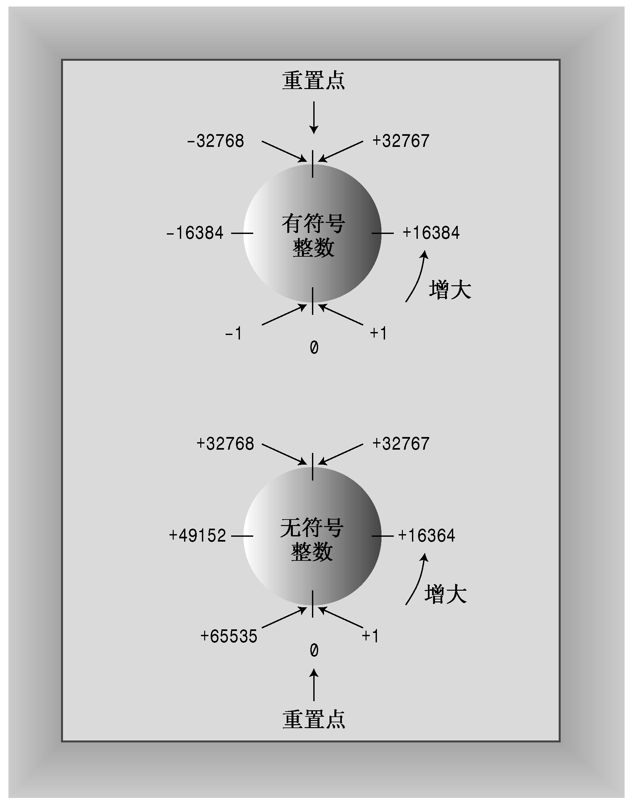

# 基础知识

## `cout` & `cin` 进行 C++ 输出&输入

从概念上看，输出是一个流，即从程序输出的一系列字符。`cout` 对象表示这种流，其属性是在 `iostream` 中定义的。
 `cout << "Hello World!" << endl;` (1) 它将字符串插入到 `cout` 流中，`endl` 表示换行符，`<<` 是插入运算符，它将字符串插入到 `cout` 流中。`<<` 指出了**信息的流动路径**，即信息从字符串流向 `cout`，相应的，`>>` 是提取运算符，它将信息从 `cin` 流向变量。
{ .annotate }

1. 消息语句：将消息发送给对象，激发某种行为

!!! info

    ***初始运算符重载***：通过重载，同一个运算符将有不同的含义，编译器通过上下文来确定运算符的含义。*如 `&` 运算符，可以表示取地址，也可以表示按位与。*  
    C++ 扩展了运算符重载的概念，允许为用户定义的类型重新定义运算符的含义。

### 典型的整型溢出行为



### `cin` 的类型不匹配情况

    int n;
    std::cin >> n;

如果用户输入一个单词而不是一个数字：

- n 的值保持不变；
- 不匹配的输入会被留在输入队列中，下一次读取将继续读取这个单词；
- `cin` 对象中的一个错误标记被设置；
- 对 `cin` 方法的调用将返回 `false`(如果被转换为 `bool` 类型)。

### 文本 I/O 和文本文件

使用 `cin` 输入时，程序将输入视为 **一系列的字节**，其中每个字节都被解释为 **字符编码**。不管目标数据类型是什么，输入一开始都是字符数据————文本数据。然后 `cin` 将这些字符转换为目标类型的值。  
假设有如下输入行：38.5 19.2

```cpp
char ch;
std::cin >> ch;
```

输入行中第一个字符被赋给 `ch`，即字符 3。输入和目标变量都是字符（ASCII），不需要进行转换。输入队列下一个字符为字符 8。

```cpp
int n;
std::cin >> n;
```

`cin` 将不断读取，直到遇到 **非数字字符**，即它将读取 38，然后将其转换为整数 38。输入队列下一个字符为「.」。

```cpp
double x;
std::cin >> x;
```

`cin` 将不断读取，直到遇到 **第一个不属于浮点数的字符**，即它将读取 38.5，然后将其转换为浮点数 38.5，再把 38.5的二进制编码（浮点格式）复制到变量 `x` 中。输入队列下一个字符为空格。

```cpp
char word[20];
std::cin >> word;
```

`cin` 将不断读取，直到遇到 **空白字符**，即它将读取 38.5，再把字符串的字符编码复制到数组 word 中，并再末尾加上 `\0`。输入队列下一个字符为空格。

```cpp
char word[20];
std::cin.get(word,20);
```

`cin` 将不断读取，直到遇到 **换行符**，即它将读取 38.5 19.2 ，再把字符串的字符编码复制到数组 word 中，并再末尾加上 `\0` 。换行符被丢弃，输入队列下一个字符为下一行的第一个字符。这里不需要转换，因为输入和目标变量都是字符（ASCII）。

对于输入则执行相反的操作，即将值转换为字符编码，然后将字符编码写入输出流。

## 文件流

### 理解 `inFile >> value` 的结果为 `inFile`

!!! info

    在 C++ 中，`>>` 是一个运算符，被称为 "提取运算符" 或 "输入运算符"。它用于从输入流（如 `cin` 或 `ifstream` 对象）读取数据。  
    当你写 `inFile >> value`，你是在告诉程序从 `inFile` 输入流读取数据，并将读取的数据存储在 `value` 变量中。  
    `>>` 运算符的一个特性是它返回的是其 ***左侧的操作数***，也就是说，表达式 `inFile >> value` 的结果是 `inFile`。这使得你可以连续使用 `>>` 运算符从同一个输入流读取多个值，如 `inFile >> value1 >> value2 >> value3`。  
    这个特性也使得你可以在 `if` 语句或 `while` 循环中使用 >> 运算符来检查读取操作是否成功。例如，你可以写 `if (inFile >> value)` 或 `while (inFile >> value)`。如果读取操作成功，`inFile` 在布尔上下文中被视为 `true`，否则被视为 `false`。

### 理解 `if(!inFile)`的合理性

`if (!inFile)` 的意思是 "如果 `inFile` 为 `false`"，则执行 `if` 语句中的代码。

- 文件流对象可以被转换为 `void*` 类型，这种转换的结果是一个空指针，如果文件流对象是有效的，则转换结果为 `false` ，否则为 `true`。
- 该对象在布尔上下文中的值是由其 **状态** 确定的，这个状态可以通过 `good(),bad(),fail(),eof()` 等函数来查询。
- `good()`：如果流成功打开，并且没有遇到任何错误 (1)，则返回 `true`。
    { .annotate }

    1. 包括 EOF 和 IO 错误
- `bad()`：如果在读写过程中发生硬件错误，或者严重的系统级错误（如磁盘空间不足），则返回 `true`。
- `fail()`：如果一个输入操作失败（例如，试图将一个字母赋值给一个整数类型的变量），则返回 `true`。
- `eof()`：如果文件指针到达文件的末尾，则返回 `true`。