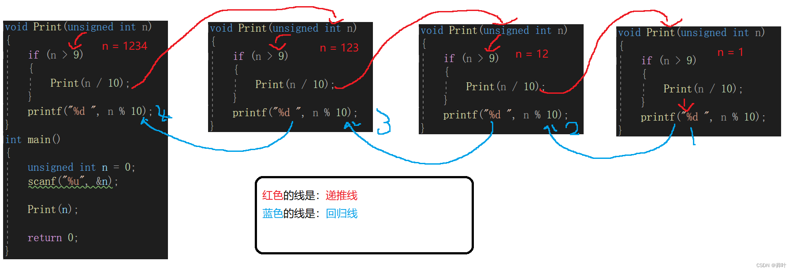

# 数据结构和算法

## 大 O 表示法

- 大 O 表示法（Big O notation）是一种用于描述算法复杂度的数学符号。它描述的是算法的 **最坏情况** 下的时间复杂度或空间复杂度。n 是输入大小，时间（运行时间）/空间（所需的内存空间）复杂度为 O(n) 则说明输入大小翻倍时，复杂度也翻倍。  
二分查找法的复杂度是 O(log n) ，即输入大小为 n 时至多进行 log n 次操作
- 一些常见的大 O 运行时间：  
  - O(log n) 对数时间——二分查找  
  - O(n) 线性时间——简单查找  
  - O(n!) 阶乘时间——旅行商问题  
  - O(n*n) 平方时间——选择排序  
  - O(1) 常量时间——散列表

!!! note

    1. 算法的速度指的并非时间，而是操作数的 **增速**，即 ***数据规模对算法时间影响的描述***。  
    2. 谈论算法的速度时，我们说的是随着输入的增加，其运行时间将以什么样的速度增加。  
    3. 算法的运行时间用大 O 表示法表示。  
    4. O(log n) 比 O(n) 快，当需要搜索的元素越多时，前者比后者快得越多。  
    5. 算法运行时间并不以秒为单位。  
    6. 算法运行时间是从其增速的角度度量的。

### 推导大 O 阶方法

1. 用常数 1 取代运行时间中的所有加法常数。
2. 在修改后的运行次数函数中，只保留最高阶项。
3. 如果最高阶项存在且不是 1，则去除与这个项相乘的常数。

## 关于递归

在递归函数中，**基线条件**（Base Case）和 **递归条件**（Recursive Case）是两个非常重要的概念。

- 基线条件：这是递归结束的条件，也就是说，当满足这个条件时，函数会停止调用自己，开始返回结果。没有基线条件的递归函数会无限递归下去，导致栈溢出。
- 递归条件：这是函数继续调用自己的条件，每次调用时，都会将问题规模减小，直到满足基线条件。

## 调用栈

调用栈（Call Stack）是一个抽象数据类型，用于存储程序执行中的 **函数调用信息**。每当一个函数被调用时，都会在调用栈上创建一个新的栈帧（调用栈中的一个元素）（Stack Frame）。这个栈帧包含了函数的参数、局部变量以及返回地址等信息。

当函数执行完毕，其对应的栈帧就会被从调用栈中移除，程序的控制权就会返回到调用该函数的代码位置（即返回地址）。这种后进先出（LIFO）的特性使得栈特别适合用于管理函数调用。

> 空间复杂度：空间的消耗主要是指 **递归次数** 造成栈空间的消耗，即调用栈的高度；递归调用的深度（也就是调用栈的高度）直接影响了算法的空间复杂度

## D&C（divide and conquer）分而治之的解决思路

1.找出基线条件，这种条件尽可能简单。  
2.将问题不断拆解，知道符合基线条件。

## 散列表

散列表是一种数据结构，它将键映射到值。散列表的一个例子是字典。在字典中，单词（键）对应于其定义（值）。

> 散列表适合用于：模拟映射关系；防止重复；缓存/记住数据，以免服务器再通过处理来生成它们。

!!! info

    ***装填因子：***  
    散列表包含的 **元素数/位置总数**，装填因子越大，冲突越多，散列表的性能越低，装填因子越小，空间利用率低，浪费空间。一旦装填因子大于 0.7，就需要调整散列表的长度，以保证散列表的性能。

## 广度优先搜索

广度优先搜索（Breadth-First Search，BFS）是一种用于图的查找算法，可用于解决两类问题：  

- 1.从节点 A 出发，有前往节点 B 的路径吗？

- 2.从节点 A 出发，前往节点 B 的哪条路径最短？

!!! note

    图（Graph）    

    - **顶点（Vertex）**：图中的元素，也称为节点；  
    - **边（Edge）**：连接两个顶点的线，表示两个顶点之间的关系。边可以有方向，也可以没有方向 (1)。（可以看成两个双向箭头形成的环）。  
    - **权重（Weight）**：边上的数值，表示从一个顶点到另一个顶点的成本或距离。
  
---

### 工作原理

创建一个队列，将起始节点放入队列中，并将其标记为已访问。
当队列非空时，进行以下操作：  

1. 从队列的头部移除一个节点（称为当前节点）。  
2. 检查当前节点的所有未访问的邻居节点，将它们添加到队列的尾部，并标记为已访问。  
3. 如果队列为空，表示所有可达节点都已访问过，搜索结束。

## 狄克斯特拉算法

狄克斯特拉算法用于在 **加权图** 中查找最短路径，***只适用于有向无环图（Directed Acyclic Graph，DAG）***。狄克斯特拉算法只适用于有向无环图，因为有环路时，加权图就会出现问题。

### 实现方法

1. 找出最便宜的节点，即可在最短时间内前往的节点。  
2. 对于该节点的邻居，检查是否有前往它们的更短路径，如果有，就更新其开销。  
3. 重复这个过程，直到对图中的每个节点都这样做了。  

具体做法建立三个数组：***节点标记 n、距离起点 dis、bool 值（是否已经是最短路径了）***  
距离一开始都初始为无穷大，找该结点所有后件到原点的距离，更新 dis，找到未将 bool 值置为 false 的最小 dis 值，将其置为 true，然后重复此过程

!!! warning

    - 狄克斯特拉算法只适用于有向无环图。
    - 不能将狄克斯特拉算法用于包含负权边的图。
    - 关键理念：找出图中最便宜的节点，并确保没有到该节点的更便宜的路径！

## 贪婪算法

贪婪算法是一种 **近似算法**，它寻找局部最优解，企图以这种方式获得全局最优解。 (1)
{ .annotate }

1. **近似算法**：近似算法是一种在多项式时间内寻找最优解的算法，但不保证能找到最优解。近似算法的运行速度通常非常快，得到的解离最优解也不会太远。一些常见的例子：Dijstra 算法、哈夫曼编码、背包问题、旅行商问题

## NP 问题

- NP 完全问题是一类问题，它们的解法尚未被发现，但也没有人能证明不存在这样的解法。这类问题的特点是：如果能快速解决它们，就能快速解决所有 NP 问题。

- NP 问题：非确定性多项式时间问题，即可以在 **多项式时间** 内验证一个解的正确性。

!!! info

    - NP 问题（非确定性多项式时间问题）的一个关键特性是，*虽然找到问题的解可能很困难，但一旦给出一个解，验证这个解是否正确则相对容易，可以在多项式时间内完成。*  
    - 这是因为验证一个解通常只需要检查解是否满足问题的所有约束条件，这通常可以通过直接的计算或比较来完成，而不需要进行复杂的搜索或优化。例如，在旅行商问题中，验证一个给定的路线是否是最短的只需要计算路线的总长度并与其他路线进行比较，而找到最短路线则需要搜索所有可能的路线组合，这在问题规模较大时可能需要非常长的时间。

### 如何判断一个问题是否是 NP 问题？

- 元素较少时算法的运行速度非常快，但随着元素数量的增加，速度会变得非常慢。
- 涉及「所有组合」的问题通常是 NP 问题。
- 不能将问题分成小问题，必须考虑各种可能的情况。这可能是 NP 完全问题。
- 不能将问题分成小问题，必须考虑各种可能的情况。这可能是 NP 完全问题。
- 如果问题涉及集合（如广播台集合）且难以解决，它可能就是 NP 完全问题。
- 如果问题可转换为集合覆盖问题或旅行商问题，那它肯定是 NP 完全问题。 (1)
    { .annotate }

    1. 摘自算法图解

## 参考资料

> 《算法图解》【美】Aditya Bhargava
